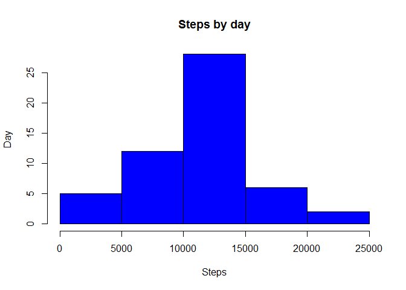
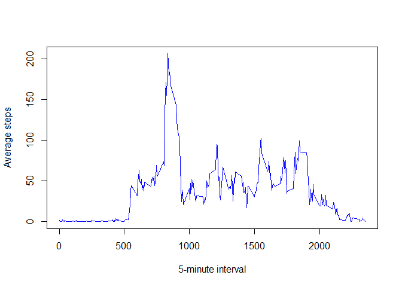
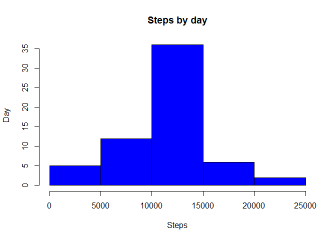
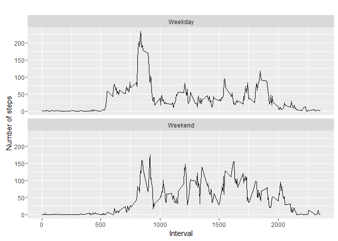

# Activity monitoring data
Angela Maria Marin A.  
4 de febrero de 2016  

This is an R Markdown document. 

###Loading and preprocessing the data


```r
library(plyr)
library(Hmisc)
library(dplyr)
```

1. Load the data (i.e. read.csv())


```r
file<-read.csv(file="D:/Mis documentos/Documents/Especialización Ciencia de Datos/M5 - Proyect week1/activity.csv",header=T)
```

2. Process/transform the data (if necessary) into a format suitable for your analysis


```r
file2<-na.omit(file)
```

###What is mean total number of steps taken per day?

1. Calculate the total number of steps taken per day


```r
steps_by_day<-ddply(file2, .(date), summarize, Steps = sum(steps))
```

2. Make a histogram of the total number of steps taken each day

```r
hist(steps_by_day$Steps, main="Steps by day", xlab="Steps", ylab="Day", col="blue")
```



3. Calculate and report the mean and median of the total number of steps taken per day


```r
# The mean without value missing
mean(steps_by_day$Steps)
```

```
## [1] 10766.19
```

```r
# The median without value missing
median(steps_by_day$Steps)
```

```
## [1] 10765
```

###What is the average daily activity pattern?

1. Make a time series plot (i.e. type = "l") of the 5-minute interval (x-axis) and the average number of steps taken, averaged across all days (y-axis)


```r
activity_pattern<-ddply(file2, .(interval), summarize, Mean_Steps = mean(steps))
plot(activity_pattern$interval,activity_pattern$Mean_Steps, type="l", xlab="5-minute interval", ylab="Average steps", col="blue")
```



2. Which 5-minute interval, on average across all the days in the dataset, contains the maximum number of steps?


```r
max<-max(activity_pattern$Mean_Steps)
subset(activity_pattern,activity_pattern$Mean_Steps==max)
```

```
##     interval Mean_Steps
## 104      835   206.1698
```

###Imputing missing values

1.Calculate and report the total number of missing values in the dataset (i.e. the total number of rows with NAs)


```r
sum(sapply(file$steps, function(x) sum(length(which(is.na(x))))))
```

```
## [1] 2304
```


2. Devise a strategy for filling in all of the missing values in the dataset. The strategy does not need to be sophisticated. For example, you could use the mean/median for that day, or the mean for that 5-minute interval, etc.


```r
strategy<-ddply(file,"interval",mutate,imputed=impute(steps,mean))
```

3. Create a new dataset that is equal to the original dataset but with the missing data filled in.


```r
ValueMiss=strategy
```

4. Make a histogram of the total number of steps taken each day and Calculate and report the mean and median total number of steps taken per day. Do these values differ from the estimates from the first part of the assignment? What is the impact of imputing missing data on the estimates of the total daily number of steps?


```r
steps_by_day_all<-ddply(ValueMiss, .(date), summarize, Steps = sum(imputed))
hist(steps_by_day_all$Steps, main="Steps by day", xlab="Steps", ylab="Day", col="blue")
```



```r
# The mean with imputed value missing
mean(steps_by_day_all$Steps)
```

```
## [1] 10766.19
```

```r
# The median with imputed value missing
median(steps_by_day_all$Steps)
```

```
## [1] 10766.19
```

```r
# The mean difference
mean(steps_by_day$Steps) - mean(steps_by_day_all$Steps)
```

```
## [1] 0
```

```r
# The median difference
median(steps_by_day$Steps) - median(steps_by_day_all$Steps)
```

```
## [1] -1.188679
```

###Are there differences in activity patterns between weekdays and weekends?

1. Create a new factor variable in the dataset with two levels - "weekday" and "weekend" indicating whether a given date is a weekday or weekend day.


```r
Sys.setlocale("LC_TIME", "English")
```

```
## [1] "English_United States.1252"
```

```r
ValueMiss['typeDay']<-weekdays(as.Date(ValueMiss$date))
ValueMiss$typeDay[ValueMiss$typeDay  %in% c('Saturday','Sunday') ] <- "Weekend"
ValueMiss$typeDay[ValueMiss$typeDay != "Weekend"] <- "Weekday"
```

2. Make a panel plot containing a time series plot (i.e. type = "l") of the 5-minute interval (x-axis) and the average number of steps taken, averaged across all weekday days or weekend days (y-axis). See the README file in the GitHub repository to see an example of what this plot should look like using simulated data.


```r
#calculate average steps by interval 
ValueMiss$typeDay <- as.factor(ValueMiss$typeDay)
Steps_by_interval <- aggregate(steps ~ interval + typeDay, ValueMiss, mean)

# creat a plot
qplot(
  interval, 
  steps, 
  data = Steps_by_interval, 
  geom=c("line"),
  xlab = "Interval", 
  ylab = "Number of steps", 
  main = "") +
  facet_wrap(~ typeDay, ncol = 1)
```


